# Section 23 — Architecture Diagrams

These diagrams describe the repository as audited. Solid arrows mean direct
composition or invocation; dotted arrows mean a contextual, cached, or external
relationship. Route-group names in parentheses do not appear in URLs.

## 23.1 Overall project structure

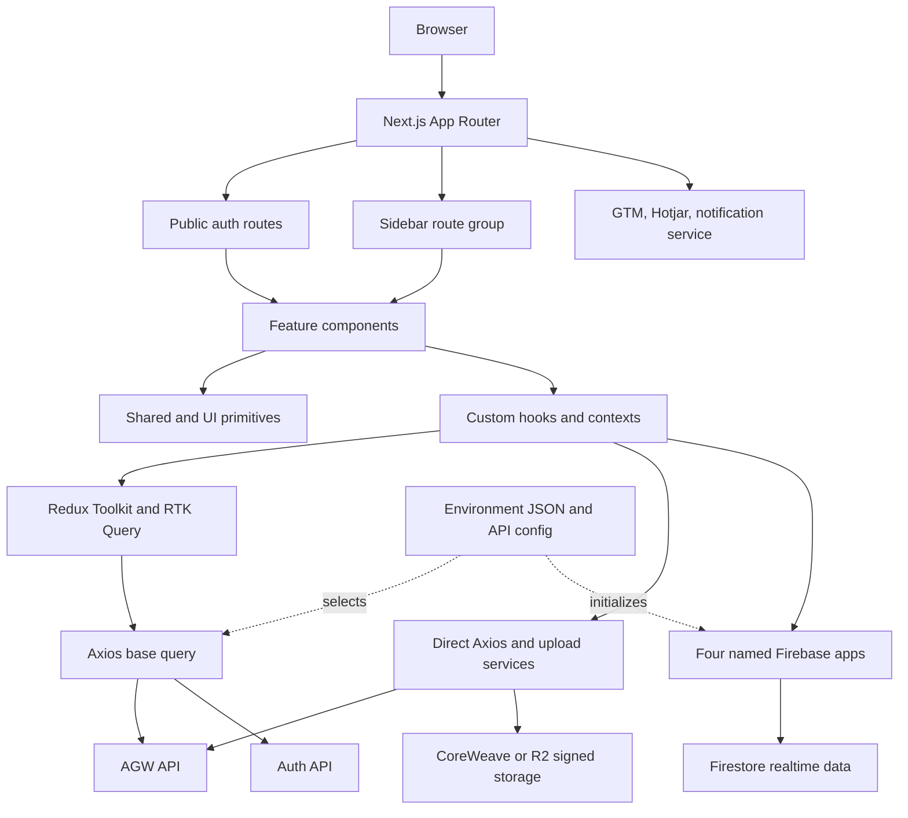

## 23.2 Complete layout and provider hierarchy

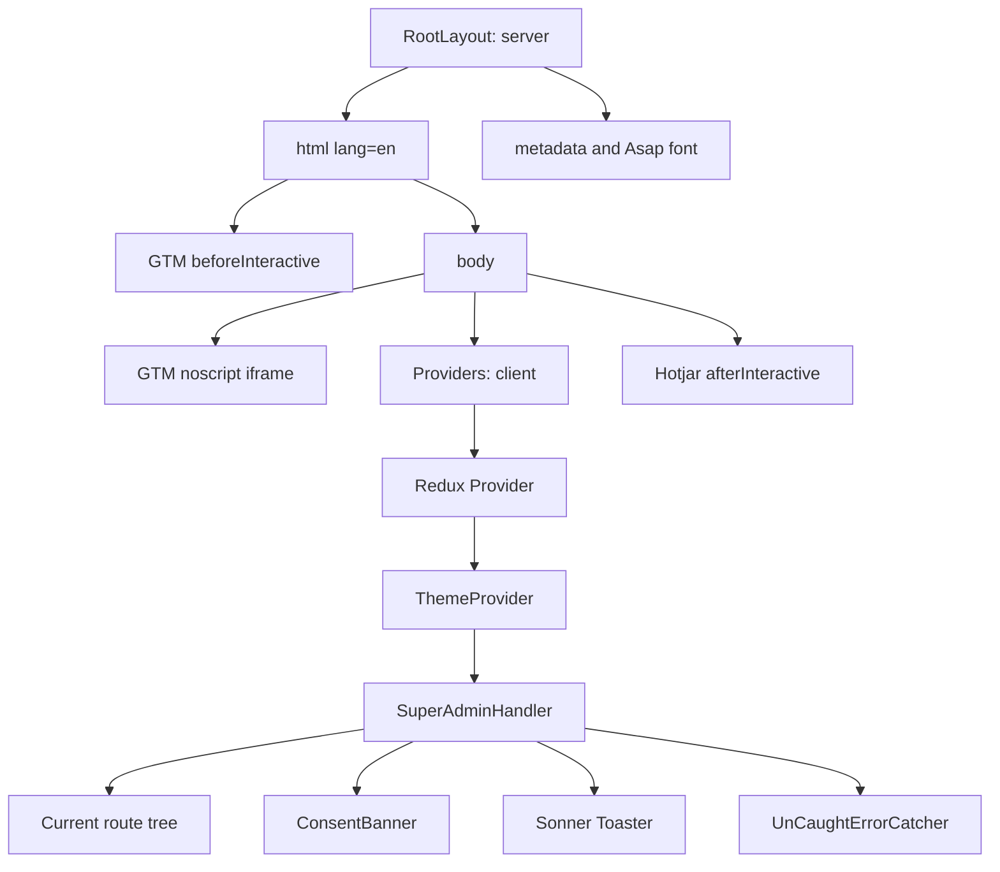

For an authenticated route, `Current route tree` expands as follows:

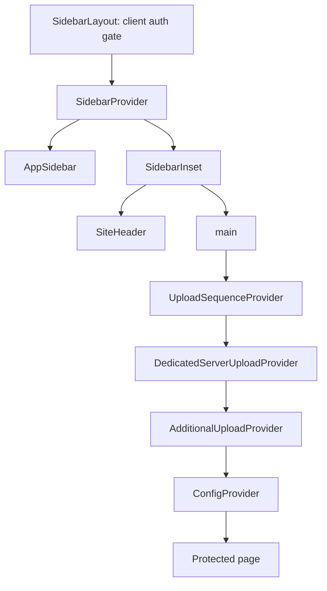

## 23.3 Navigation and route map

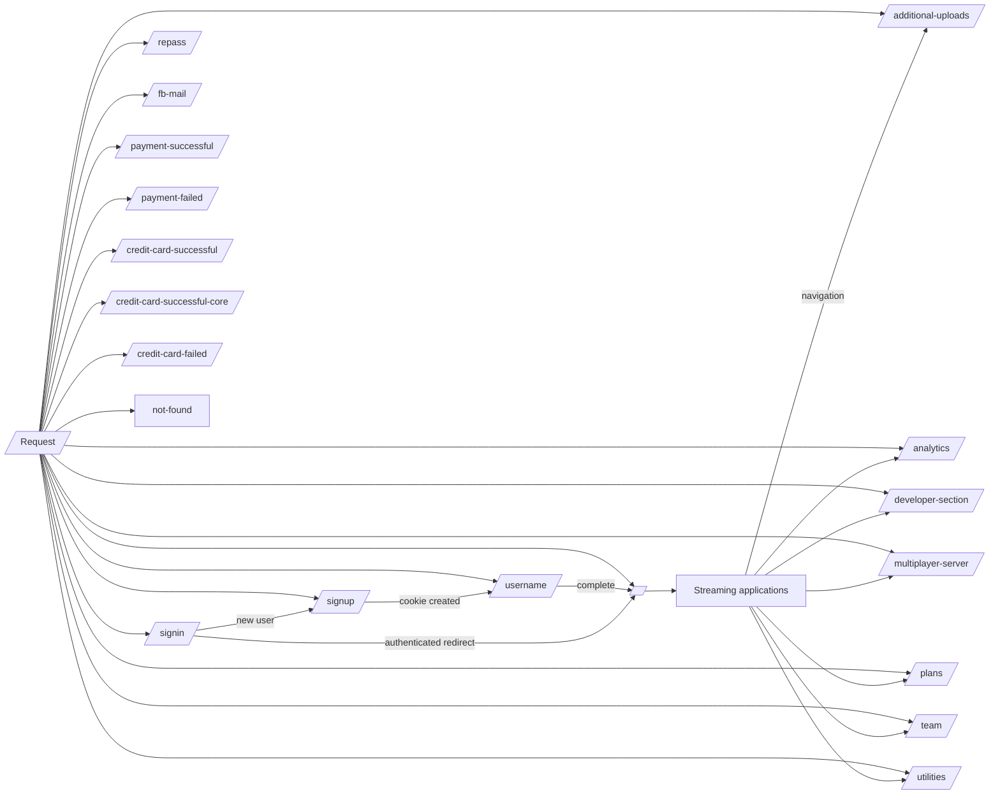

Every audited route is statically prerendered as a shell. The protected group
performs its redirect decisions on the client after hydration.

## 23.4 Route-to-core-component tree

```mermaid
flowchart TD
  R0["/ page.js"]
  RSignin["/signin"]
  RSignup["/signup"]
  RUsername["/username"]
  RReset["/repass"]
  RMail["/fb-mail"]
  RAdditional["/additional-uploads"]
  RAnalytics["/analytics"]
  RDev["/developer-section"]
  RDS["/multiplayer-server"]
  RPlans["/plans"]
  RTeam["/team"]
  RUtilities["/utilities"]
  RPay["payment result routes"]

  Stream[StreamingApp Application]
  StreamList[ApplicationList and ApplicationCard]
  Config[Config form and dialogs]
  Upload[Upload dialog and sequence provider]
  Auth[Signin form and Google signin]
  Signup[Signup stages and OTP]
  User[Username and profile completion]
  Add[AdditionalUpload Application and table]
  Analytic[Analytics Application]
  Charts[Chart tabs: CCU, duration, location, app]
  Table[Analytics table]
  Developer[DeveloperSection Application]
  Key[API key, token, version-control panels]
  Dedicated[DedicatedServer Application]
  DSCards[App cards, instance details, monitor]
  Plan[Plan Application]
  Legacy[Legacy plan cards and dialogs]
  Core[Core/minute/GB subscription UI]
  Teams[Team Application and member table]
  Utils[Utilities Application]
  Monitors[Streaming and server monitor tables]
  Billing[Post-payment status component]

  R0 --> Stream
  Stream --> StreamList
  Stream --> Config
  Stream --> Upload
  RSignin --> Auth
  RSignup --> Signup
  RUsername --> User
  RReset --> Auth
  RMail --> Auth
  RAdditional --> Add
  RAnalytics --> Analytic
  Analytic --> Charts
  Analytic --> Table
  RDev --> Developer
  Developer --> Key
  RDS --> Dedicated
  Dedicated --> DSCards
  RPlans --> Plan
  Plan --> Legacy
  Plan --> Core
  RTeam --> Teams
  RUtilities --> Utils
  Utils --> Monitors
  RPay --> Billing
```

The exhaustive leaf-level component, hook, import, props, state, and consumer
inventory is in `04-file-catalog.md`; this diagram intentionally keeps the full
screen tree readable.

## 23.5 Authentication lifecycle

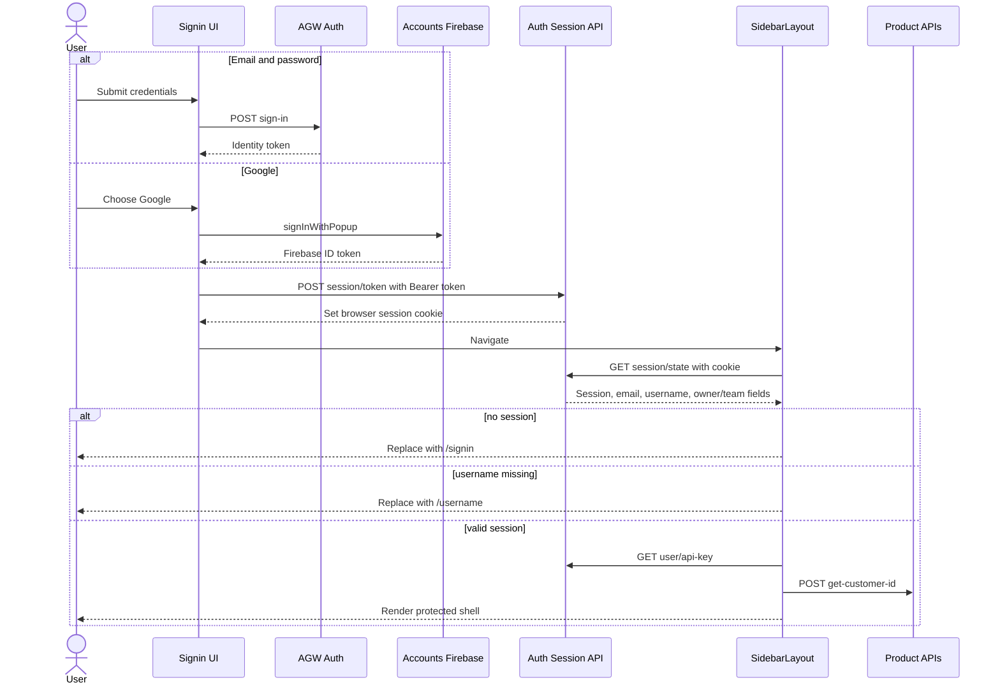

## 23.6 Request lifecycle and cache invalidation

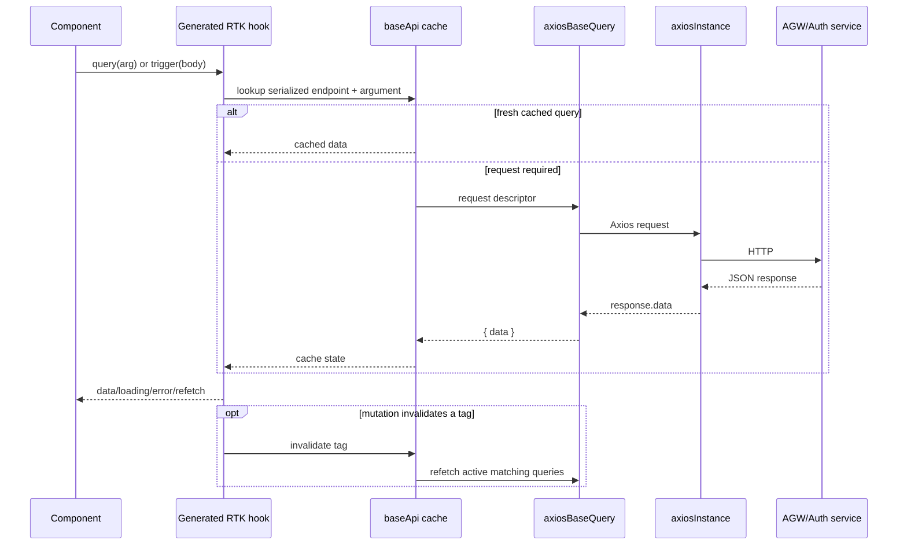

Important defect: the current Axios error interceptor returns an error object,
which can follow the success branch rather than reject into `axiosBaseQuery`'s
catch.

## 23.7 Streaming-app upload state machine

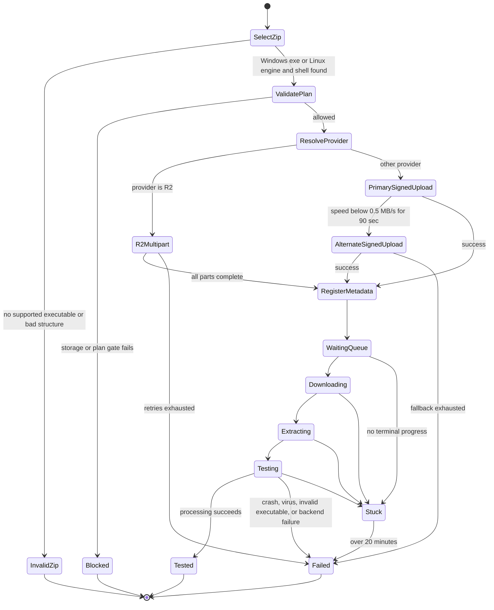

The Context state is not persisted, so refresh does not resume the local workflow.
Firestore may still contain processing state, but no rehydration path reconstructs
the complete upload machine.

## 23.8 State-management map

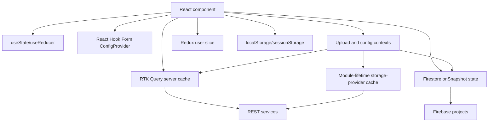

Use local state for leaf UI, React Hook Form for the large config schema, Context
for tightly scoped workflows, RTK Query for REST server state, and Firestore
listeners for realtime server state. Do not duplicate one server value into several
stores unless the synchronization rule is explicit.

## 23.9 Subscription decision flow

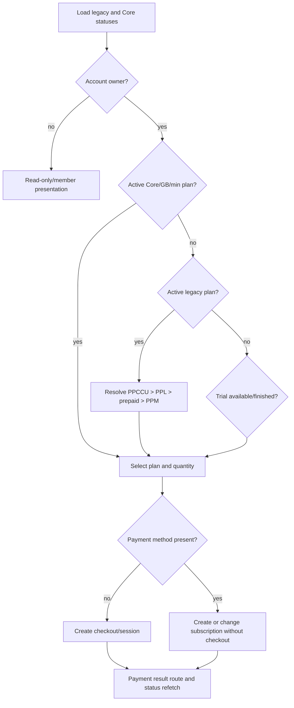

Business-policy enforcement must remain backend-side even though this UI guides the
path.

## 23.10 Folder dependency direction

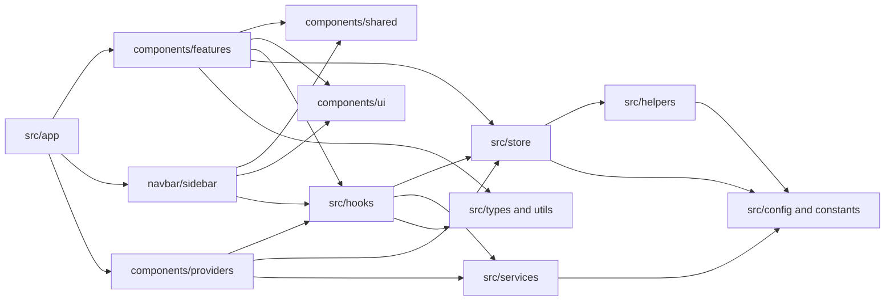

The desired dependency direction is left/top toward right/bottom. A feature import
from a UI primitive, or a page import from a utility, is an architectural warning.

### Section 23 closeout

**Key takeaways**

- The entire app is one root provider tree plus a heavier authenticated provider
  tree.
- REST, upload storage, and realtime Firebase have separate lifecycles.
- Route protection happens after hydration.
- Upload is a multi-system state machine, not a single HTTP request.

**Common pitfalls**

- Reading route-group names as URL segments.
- Assuming the consent banner gates scripts.
- Treating query invalidation as universal when tags are inconsistent.
- Moving a component without tracing context dependencies.

**Questions to ask a mentor**

- Which provider can be made route-specific first?
- What is the authoritative upload-state transition contract?
- Are payment callback routes intentionally protected?
- Which external system owns each production incident class?

**Related files to read next**

- `src/app/layout.tsx`
- `src/app/(withSidebarLayout)/layout.tsx`
- `src/components/providers.tsx`
- `src/store/api/*`
- `src/components/providers/upload/*`

**Practical exercises**

- Redraw the provider tree from memory.
- Add one endpoint and show its request/cache path.
- Mark every security boundary on the auth diagram.
