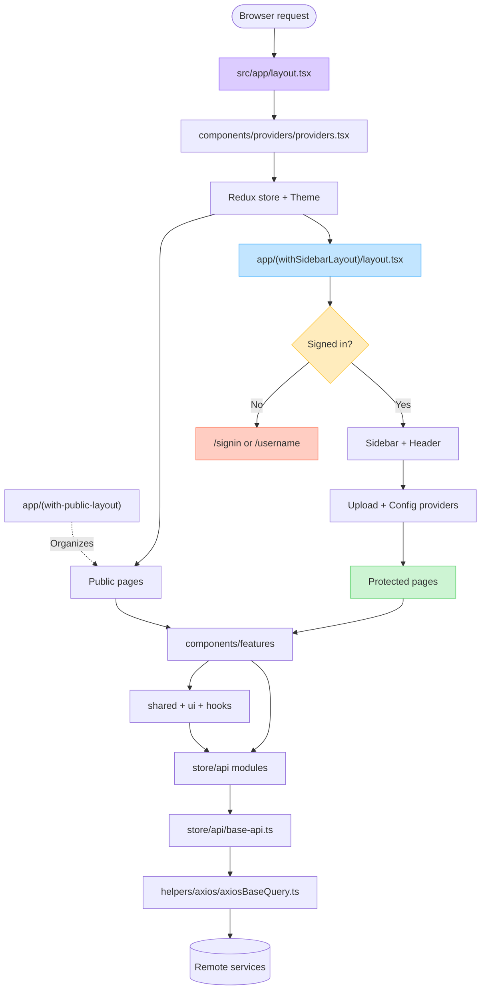

# Project Parent and Flow Map

This map shows the runtime parent files, route tree, and the main dependency
direction of the `cp-next` project.

## Parent file map



Important: `(with-public-layout)` is only a route group. It has no
`layout.tsx`, so its pages are wrapped directly by the root layout.

## File tree

```text
cp-next/
├── package.json                       # scripts and dependencies
├── next.config.ts                    # Next.js configuration
├── config.staging.json               # staging service URLs
├── config.prod.json                  # production service URLs
├── public/                            # files served as static assets
├── docs/                              # project documentation
└── src/
    ├── app/                           # Next.js App Router
    │   ├── layout.tsx                 # ROOT PARENT: wraps every route
    │   ├── globals.css                # global styles loaded by RootLayout
    │   ├── not-found.tsx              # unmatched-route page
    │   ├── (with-public-layout)/      # URL-less route group; no layout file
    │   │   ├── signin/page.tsx        # /signin
    │   │   ├── signup/page.tsx        # /signup
    │   │   ├── username/page.tsx      # /username
    │   │   ├── repass/page.tsx        # /repass
    │   │   └── fb-mail/page.tsx       # /fb-mail
    │   └── (withSidebarLayout)/
    │       ├── layout.tsx             # PROTECTED PARENT: auth + app shell
    │       ├── page.tsx               # /
    │       ├── additional-uploads/    # /additional-uploads
    │       ├── analytics/             # /analytics
    │       ├── developer-section/     # /developer-section
    │       ├── multiplayer-server/    # /multiplayer-server
    │       ├── plans/                 # /plans
    │       ├── team/                  # /team
    │       ├── utilities/page.tsx     # /utilities
    │       ├── payment-successful/    # /payment-successful
    │       ├── payment-failed/        # /payment-failed
    │       ├── credit-card-successful/
    │       ├── credit-card-successful-core/
    │       └── credit-card-failed/
    ├── components/
    │   ├── providers/
    │   │   ├── providers.tsx          # Redux + theme parent
    │   │   ├── config-provider.tsx    # streaming configuration form state
    │   │   └── upload/                # upload workflow parents
    │   ├── features/                  # screen/business feature components
    │   ├── sidebar/                   # protected navigation
    │   ├── navbar/                    # protected header
    │   ├── shared/                    # reusable project components
    │   └── ui/                        # low-level UI primitives
    ├── hooks/                         # reusable React data/behavior hooks
    ├── store/
    │   ├── store.ts                   # Redux parent store
    │   ├── slices/                    # local Redux state
    │   └── api/
    │       ├── base-api.ts            # RTK Query parent API
    │       └── *.ts                   # feature endpoint modules
    ├── helpers/axios/
    │   ├── axiosBaseQuery.ts          # RTK Query-to-Axios adapter
    │   └── axiosInstance.ts           # shared HTTP client
    ├── services/                      # direct storage/upload integrations
    ├── config/                        # runtime URLs, Firebase, routes
    ├── assets/                        # bundled images and SVGs
    ├── utils/                         # general utility functions
    ├── types/                         # shared TypeScript contracts
    ├── constant/                      # static domain constants
    ├── lib/                           # small library helpers
    └── styles/                        # font/style helpers
```

## Parent chains for common routes

### Protected route example: `/analytics`

```text
src/app/layout.tsx
└── components/providers/providers.tsx
    └── src/app/(withSidebarLayout)/layout.tsx
        ├── AppSidebar
        ├── Header
        └── UploadSequenceProvider
            └── DedicatedServerUploadProvider
                └── AdditionalUploadProvider
                    └── ConfigProvider
                        └── analytics/page.tsx
                            └── features/analytics/analytics-page.tsx
```

### Public route example: `/signin`

```text
src/app/layout.tsx
└── components/providers/providers.tsx
    └── (with-public-layout)/signin/page.tsx
        └── features/signin/signin-page.tsx
```

## How to trace a feature

Start from its route `page.tsx`, then follow this direction:

```text
page.tsx
  -> components/features/<feature>/
  -> components/shared/ or components/ui/
  -> hooks/
  -> store/api/<feature>.ts
  -> store/api/base-api.ts
  -> helpers/axios/axiosBaseQuery.ts
  -> remote API
```

Uploads are the main exception: feature/provider code can call
`src/services/` directly for signed or multipart storage uploads.
