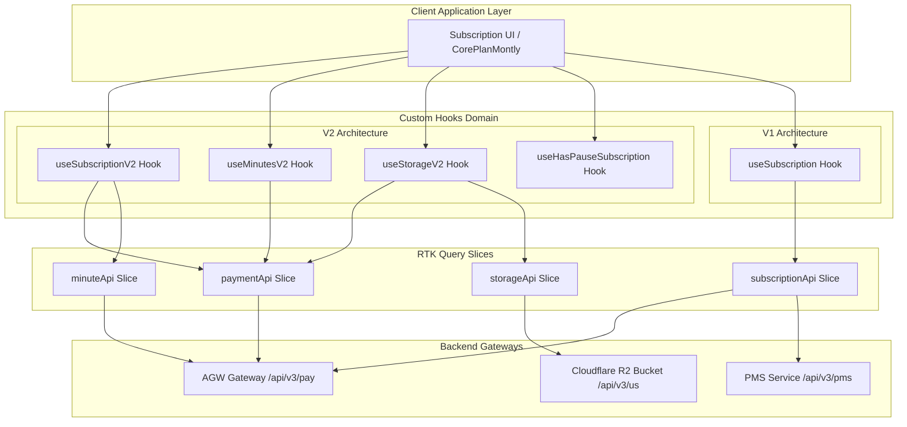
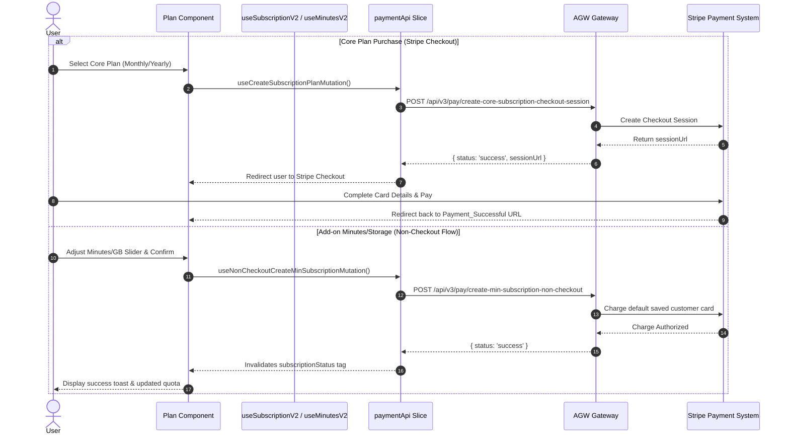

# Subscription Architecture & Technical Documentation

This document provides a comprehensive breakdown of the subscription system in this project, covering **Terminologies & Concepts**, **API Catalogue**, **Codebase Architecture & Hooks**, **Lifecycle & Purchase Flows**, and **Flow Diagrams**.

---

## 1. Key Terminologies & Concepts

The system operates across two generations of subscription models: **Legacy Subscription Architecture (V1)** and **Unified Core Subscription Architecture (V2)**.

| Terminology | Full Name / Meaning | Category | Description |
| :--- | :--- | :--- | :--- |
| **`CORE` / `CORE PLAN`** | Core Subscription | V2 Plan | The primary baseline plan (available Monthly or Yearly). Bundles free base storage (GBs), streaming minutes, and CCU allocations. |
| **`PPCCU`** | Pay Per Concurrent User | V1 Plan | Legacy pricing model where users pay per concurrent streaming instance/slot running at the same time. |
| **`PPL`** | Pay Per License | V1 Plan | Legacy pricing model based on dedicated application licenses. |
| **`PPM`** | Pay Per Minute | V1 Plan | Pay-as-you-go model where usage is billed after streaming minutes are consumed. |
| **`PREPAID_MINUTE`** | Prepaid Streaming Minutes | V1 Plan / Add-on | Purchasing a fixed bucket of streaming minutes upfront before streaming. |
| **`STORAGE` / `GB`** | Storage Subscription | Add-on | Extra cloud storage allocation (R2 storage bucket size) beyond bundled plan limits. |
| **`TRIAL` / `FREE`** | Free Tier / Trial Period | Base Tier | Initial free usage sandbox (e.g., 60 free minutes and 5 GB free R2 storage). |
| **`Non-Checkout`** | Non-Checkout Purchase | Transaction | Charging an existing customer using their default saved Stripe payment method (`customerId`) without redirecting to a Stripe Checkout URL. |
| **`Pause Collection`** | `pause_collection` | Status State | Occurs when a payment attempt fails or account billing is paused. Halts active streaming capabilities while keeping account data intact. |
| **`Temporary Cancelled`**| `cancel_at` | Status State | Subscription is scheduled to be cancelled at the end of the current billing cycle, but remains active until `current_period_end`. |
| **`Shadow Subscription`**| Shadow Billing Period | Alignment | A secondary period object (`shadow.current_period_start` / `end`) used to align yearly subscription periods with sub-period usage windows. |
| **`PMS` / `Budget`** | Payment Management Service | Backend Subsystem | Backend microservice managing usage caps, budget thresholds (`budget-change-add`, `budget-change-increase`), and watcher notifications (`add-watcher`). |

---

## 2. API Catalogue & Endpoints

All API endpoints are configured in [`src/config/api.ts`](file:///e:/E3DS/cp-drivesync-feature/cp-next/src/config/api.ts) and consumed via RTK Query slices in `src/store/api/`.

### 2.1 Core Plan & Payment APIs ([`src/store/api/payment.ts`](file:///e:/E3DS/cp-drivesync-feature/cp-next/src/store/api/payment.ts))

| RTK Endpoint / Hook | Endpoint Path | Method | Purpose |
| :--- | :--- | :--- | :--- |
| `useCreateSubscriptionPlanMutation` | `/api/v3/pay/create-core-subscription-checkout-session` | `POST` | Generates Stripe Checkout Session URL for Monthly or Yearly Core Plan. |
| `useCheckStatusQuery` | `/api/v3/pay/check-core-subscription-status` | `POST` | Fetches core subscription details (metadata, period, shadow timestamps). |
| `useCheckStatusGbQuery` | `/api/v3/pay/check-gb-subscription-status` | `POST` | Fetches status of additional purchased storage GBs. |
| `useCheckStatusMinQuery` | `/api/v3/pay/check-min-subscription-status` | `POST` | Fetches status of additional purchased streaming minutes. |
| `useDataQuoteQuery` | `/api/v3/pay/get-coded-subscription-quote` | `POST` | Calculates prorated invoice preview/quote for upgrading or downgrading limits. |
| `useUpgradeSubscriptionMutation` | `/api/v3/pay/upgrade-coded-subscription` | `POST` | Upgrades core plan, minutes, or GB quantities. |
| `useDowngradeSubscriptionMutation` | `/api/v3/pay/downgrade-subscription` | `POST` | Downgrades core plan, minutes, or GB quantities. |
| `useNonCheckoutCreateMinSubscriptionMutation` | `/api/v3/pay/create-min-subscription-non-checkout` | `POST` | Direct purchase of additional streaming minutes using saved credit card. |
| `useNonCheckoutCreateGbSubscriptionMutation` | `/api/v3/pay/create-gb-subscription-non-checkout` | `POST` | Direct purchase of extra storage GBs using saved credit card. |
| `useUnPauseSubscriptionMutation` | `/api/v3/pay/unpause-subscription` | `POST` | Resumes/Unpauses a subscription after fixing payment issue. |
| `useEditPaymentMutation` | `/api/v3/pay/payment-method` | `POST` | Updates payment method for standard subscriptions. |
| `useEditPaymentForCoreMutation` | `/api/v3/pay/payment-method-subwise` | `POST` | Updates credit card details specific to a core subscription. |
| `usePaymentMethodConfirmationCoreMutation` | `/api/v3/pay/confirm-payment-method-change` | `POST` | Confirms card setup/change for core subscription. |
| `useInvoiceListQuery` | `/api/v3/pay/list-invoices` | `POST` | Retrieves historical Stripe billing invoices. |

---

### 2.2 V1 & Legacy Subscription APIs ([`src/store/api/subscription.ts`](file:///e:/E3DS/cp-drivesync-feature/cp-next/src/store/api/subscription.ts))

| RTK Endpoint / Hook | Endpoint Path | Method | Purpose |
| :--- | :--- | :--- | :--- |
| `usePpccuStatusQuery` | `/api/v3/pay/check-subscription-status-ppccu` | `POST` | Checks status of PPCCU plan. |
| `usePplStatusQuery` | `/api/v3/pay/check-subscription-status-ppl` | `POST` | Checks status of PPL plan. |
| `usePrepaidMinuteStatusQuery` | `/api/v3/pay/check-subscription-status-pre-paid-minute` | `POST` | Checks status of prepaid minute plan. |
| `usePpmStatusQuery` | `/api/v3/pms/status` | `POST` | Checks status of PPM plan via PMS microservice. |
| `useCreatePpccuSubMutation` | `/api/v3/pay/create-subscription-ppccu` | `POST` | Creates PPCCU subscription checkout. |
| `useCreatePplSubMutation` | `/api/v3/pay/create-subscription-ppl` | `POST` | Creates PPL subscription checkout. |
| `useCreatePrepaidMinuteSubMutation` | `/api/v3/pay/create-subscription-pre-paid-minute` | `POST` | Creates prepaid minute subscription checkout. |
| `useCreatePpmSubMutation` | `/api/v3/pms/create-subscription-ppm` | `POST` | Creates PPM subscription. |
| `useCancelAllSubMutation` | `/api/v3/pay/pro-cancel-all-subscriptions` | `POST` | Cancels all active subscriptions associated with the account. |
| `useCancelPpmSubMutation` | `/api/v3/pms/cancel` | `POST` | Cancels PPM subscription. |
| `useReactiveAllSubMutation` | `/api/v3/pay/reactivate-all-subscriptions` | `POST` | Reactivates cancelled subscriptions. |
| `usePpccuQuoteQuery` / `usePplQuoteQuery` | `/api/v3/pay/get-subscription-quote-ppcu` | `POST` | Quote estimation for PPCCU/PPL adjustments. |
| `useAddWatcherMutation` | `/api/v3/pms/add-watcher` | `POST` | Sets up automated PMS limit watching. |

---

### 2.3 Storage & Usage APIs ([`src/store/api/storage.ts`](file:///e:/E3DS/cp-drivesync-feature/cp-next/src/store/api/storage.ts) & [`src/store/api/minute.ts`](file:///e:/E3DS/cp-drivesync-feature/cp-next/src/store/api/minute.ts))

| RTK Endpoint / Hook | Endpoint Path | Method | Purpose |
| :--- | :--- | :--- | :--- |
| `useStorageStatusQuery` | `/api/v3/pay/check-subscription-status-storage` | `POST` | Gets status of storage subscription. |
| `useStorageUtilizedQuery` | `/api/v3/us/size-r2` | `POST` | Queries exact consumed storage (in GB) from Cloudflare R2 bucket. |
| `useMinuteStreamedQuery` | `/api/v3/fb/singular-stream` | `POST` | Calculates total streaming minutes consumed within start/end ISO timestamps. |
| `useCreateStorageSubMutation` | `/api/v3/pms/create-subscription-storage` | `POST` | Subscribes to additional R2 storage. |

---

## 3. Code Architecture & Custom Hooks Explanation

The application manages state through custom React hooks that synthesize raw RTK Query data into clean domain models for UI rendering:

```
                  ┌──────────────────────────────┐
                  │      useUserAllInfoQuery     │
                  └──────────────┬───────────────┘
                                 │
   ┌─────────────────────────────┼─────────────────────────────┐
   ▼                             ▼                             ▼
┌──────────────────────┐ ┌──────────────────────┐ ┌──────────────────────┐
│  useSubscriptionV2   │ │     useMinutesV2     │ │     useStorageV2     │
│ (Core plan & period) │ │ (Extra & used min)   │ │ (Extra & used storage│
└──────────┬───────────┘ └──────────┬───────────┘ └──────────┬───────────┘
           │                        │                        │
           └────────────────────────┼────────────────────────┘
                                    ▼
                      ┌───────────────────────────┐
                      │  useHasPauseSubscription  │
                      │(Evaluates pause collection│
                      └───────────────────────────┘
```

### 3.1 Hook Explanations

1. **[`useSubscriptionV2.ts`](file:///e:/E3DS/cp-drivesync-feature/cp-next/src/hooks/use-subscription-v2.ts)**:
   - Fetches product base limits (`freeStorage`, `freeMin`, `freeCcu`) via `useUserAllInfoQuery`.
   - Calls `useCheckStatusQuery({ code: 'core' })` to read metadata, `current_period_start`, `current_period_end`, and shadow period timestamps for yearly subscriptions.
   - Calculates effective billing window, days left, subscription ID, and queries `useMinuteStreamedQuery` for streaming time used during the active billing period.

2. **[`useMinutesV2.ts`](file:///e:/E3DS/cp-drivesync-feature/cp-next/src/hooks/use-minute-v2.ts)**:
   - Queries extra minute subscription status (`useCheckStatusMinQuery({ code: 'min' })`).
   - Computes total available minutes: `corePlanFreeMin + minQuantity`.
   - Checks if minutes are exhausted: `streamTime >= minQuantity + corePlanFreeMin`.

3. **[`useStorageV2.ts`](file:///e:/E3DS/cp-drivesync-feature/cp-next/src/hooks/use-storageV2.ts)**:
   - Queries extra storage subscription (`useCheckStatusGbQuery({ code: 'gb' })`) and consumed R2 storage (`useStorageUtilizedQuery`).
   - Computes max available storage: `baseStorage + quantity`.
   - Calculates storage percentage used, remaining storage, and progress metrics.

4. **[`useHasPauseSubscription.ts`](file:///e:/E3DS/cp-drivesync-feature/cp-next/src/hooks/use-has-pause-sub.ts)**:
   - Aggregates pause flags across core, minute, and storage subscriptions (`pause_collection`).
   - Returns consolidated `hasPause` flag to display payment update modals when any subscription fails payment collection.

5. **[`useTrialV2.ts`](file:///e:/E3DS/cp-drivesync-feature/cp-next/src/hooks/use-trial-v2.ts)**:
   - Evaluates free tier usage against product limits (`freeMin: 60`, `freeStorage: 5GB`).
   - Tracks if trial limits have been breached (`hasMinFinish`, `hasStorageFinish`, `hasTrialFinish`).

6. **[`useSubscription.ts`](file:///e:/E3DS/cp-drivesync-feature/cp-next/src/hooks/use-subscription.ts)** (V1 Legacy):
   - Aggregates status across PPCCU, PPL, Prepaid Minute, and PPM plans using helper `isActiveSubscription(status)`.

---

## 4. System Flow Diagrams

### Diagram 1: Subscription Data Flow & Hook Resolution Architecture



---

### Diagram 2: Core Plan & Add-on Purchase Flow (Checkout vs Non-Checkout)



---

### Diagram 3: Subscription Status Lifecycle & Pause/Cancel Handling

```mermaid
stateDiagram-v2
    [*] --> Trial: Account Created
    Trial --> Active: Purchase Core Plan
    Trial --> Expired: Minutes or Storage Exhausted

    state Active {
        [*] --> NormalBilling
        NormalBilling --> TemporaryCancelled: User Cancels (cancel_at set)
        TemporaryCancelled --> Active: Reactivate before period end
        TemporaryCancelled --> Canceled: Billing Period Ends
        NormalBilling --> Paused: Payment Failed (pause_collection set)
        Paused --> NormalBilling: Unpause via useUnPauseSubscriptionMutation
    }

    Canceled --> Active: Purchase New Plan
    Expired --> Active: Purchase Plan
```

---

## 5. Summary of Main UI Components

- [`src/components/features/subscription/subscription.tsx`](file:///e:/E3DS/cp-drivesync-feature/cp-next/src/components/features/subscription/subscription.tsx): Root layout rendering plan details based on active subscription model.
- [`src/components/features/new-subscription/core-plan-montly.tsx`](file:///e:/E3DS/cp-drivesync-feature/cp-next/src/components/features/new-subscription/core-plan-montly.tsx): Core Monthly management component handling minute adjustments, plan cancellations, and pause banners.
- [`src/components/features/new-subscription/core-plan-yearly.tsx`](file:///e:/E3DS/cp-drivesync-feature/cp-next/src/components/features/new-subscription/core-plan-yearly.tsx): Core Yearly management component handling shadow period alignment and yearly plan upgrades.
- [`src/components/features/new-subscription/core-plan-montly-storage.tsx`](file:///e:/E3DS/cp-drivesync-feature/cp-next/src/components/features/new-subscription/core-plan-montly-storage.tsx): Dedicated component for adjusting R2 cloud storage allocations.
- [`src/components/features/subscription/new-subscription-summary/pause-plan.tsx`](file:///e:/E3DS/cp-drivesync-feature/cp-next/src/components/features/subscription/new-subscription-summary/pause-plan.tsx): Banner component displayed when `pause_collection` is active due to transaction failure.
