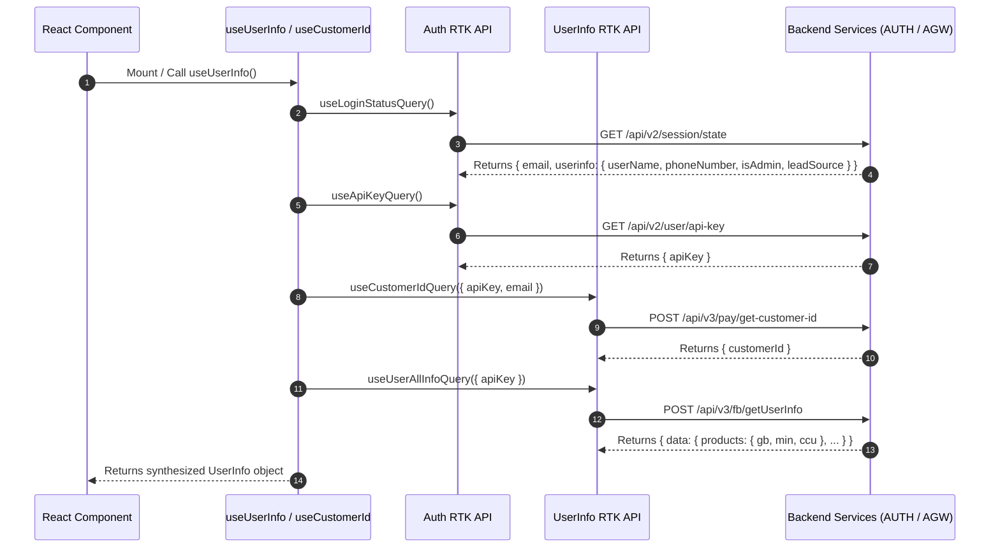
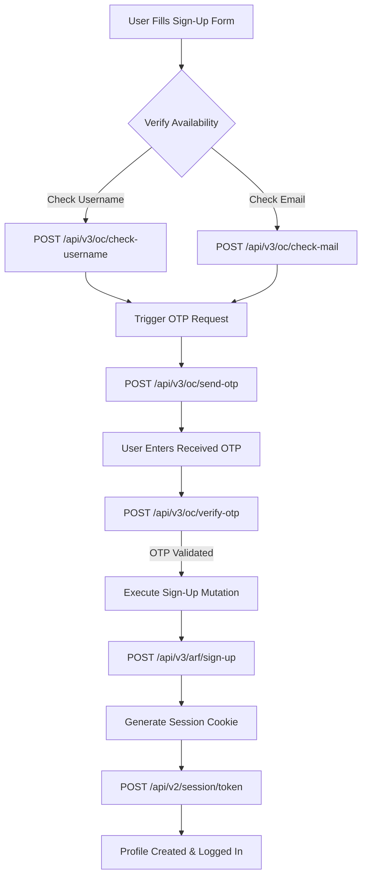

# Technical Architecture Guide: Profile Fetching, User Creation, and Subscription Management

This document provides an end-to-end technical explanation of how user profile data is fetched, how new user profiles are created, and how subscription plans are managed within the `cp-next` application.

---

## 1. Profile Data Fetching Architecture

Profile data fetching is handled through Redux Toolkit (RTK) Query endpoints defined in [`auth.ts`](file:///e:/E3DS/cp-drivesync-feature/cp-next/src/store/api/auth.ts) and [`user-info.ts`](file:///e:/E3DS/cp-drivesync-feature/cp-next/src/store/api/user-info.ts), encapsulated by the [`useUserInfo`](file:///e:/E3DS/cp-drivesync-feature/cp-next/src/hooks/use-user-info.ts) and [`useCustomerId`](file:///e:/E3DS/cp-drivesync-feature/cp-next/src/hooks/use-customer-id.ts) custom React hooks.



### Key RTK Query Endpoints & Code Snippets

#### A. Session State Fetching (`authApi`)
- **Endpoint**: `GET /api/v2/session/state` ([`API.Check_Login_Status`](file:///e:/E3DS/cp-drivesync-feature/cp-next/src/config/api.ts#L140))
- **File**: [`src/store/api/auth.ts`](file:///e:/E3DS/cp-drivesync-feature/cp-next/src/store/api/auth.ts#L7-L14)

```typescript
loginStatus: build.query({
  query: () => ({
    url: API.Check_Login_Status,
    method: 'GET',
    withCredentials: true
  }),
  providesTags: [tagTypes.loginStatus]
})
```

#### B. Detailed User & Product Limits Fetching (`userInfoApi`)
- **Endpoint**: `POST /api/v3/fb/getUserInfo` ([`API.User_Info`](file:///e:/E3DS/cp-drivesync-feature/cp-next/src/config/api.ts#L51))
- **File**: [`src/store/api/user-info.ts`](file:///e:/E3DS/cp-drivesync-feature/cp-next/src/store/api/user-info.ts#L14-L20)

```typescript
userAllInfo: build.query({
  query: data => ({
    url: API.User_Info,
    method: 'POST',
    body: data // { apiKey }
  })
})
```

#### C. Custom Hook Consolidation (`useUserInfo`)
- **File**: [`src/hooks/use-user-info.ts`](file:///e:/E3DS/cp-drivesync-feature/cp-next/src/hooks/use-user-info.ts#L15-L103)
- Aggregates `email`, `username`, `phoneNumber`, `isAdmin`, `apiKey`, `customerId`, and handles cross-tab Super Admin impersonation via `localStorage`.

---

## 2. New Profile Creation & Registration Flow

Creating a new profile involves input validation, OTP verification, registration mutation, and session cookie generation.



### Relevant Code & Mutations ([`src/store/api/auth.ts`](file:///e:/E3DS/cp-drivesync-feature/cp-next/src/store/api/auth.ts))

1. **Username Availability**:
   ```typescript
   verifyUserName: build.mutation({
     query: data => ({
       url: API.Username_Verify, // /api/v3/oc/check-username
       method: 'POST',
       body: data
     })
   })
   ```

2. **Email Verification**:
   ```typescript
   verifyEmail: build.mutation({
     query: data => ({
       url: API.Email_Verify, // /api/v3/oc/check-mail
       method: 'POST',
       body: data
     })
   })
   ```

3. **OTP Delivery & Verification**:
   ```typescript
   sendOtp: build.mutation({
     query: data => ({ url: API.Send_OTP, method: 'POST', body: data })
   }),
   verifyOtp: build.mutation({
     query: data => ({ url: API.Verify_OTP, method: 'POST', body: data })
   })
   ```

4. **Sign-Up & Cookie Creation**:
   ```typescript
   signUp: build.mutation({
     query: data => ({ url: API.Sign_Up, method: 'POST', body: data })
   }),
   generateCookie: build.mutation({
     query: data => ({
       url: API.Generate_Cookie, // /api/v2/session/token
       method: 'POST',
       headers: { Authorization: `Bearer ${data.token}` },
       withCredentials: true
     })
   })
   ```

---

## 3. Plan & Subscription Architecture

`cp-next` supports multiple subscription billing models (Pay-Per-Concurrent-User `PPCCU`, Pay-Per-License `PPL`, Prepaid Minutes `PPM`, Core Plan) managed via [`subscription.ts`](file:///e:/E3DS/cp-drivesync-feature/cp-next/src/store/api/subscription.ts) and [`payment.ts`](file:///e:/E3DS/cp-drivesync-feature/cp-next/src/store/api/payment.ts).

### Subscription Types Overview

| Billing Model | API Code / Endpoint | Description |
| :--- | :--- | :--- |
| **Core Subscription** | `API.Core_Plan` / `API.Check_Status` | Unified subscription checking status and quotas (`gb`, `min`, `ccu`). |
| **PPCCU** | `API.Create_PPCCU_Sub` / `API.Check_Sub_PPCCU` | Pay Per Concurrent User for multi-instance streaming seats. |
| **PPL** | `API.Create_Sub_PPL` / `API.Check_Sub_PPL` | Pay Per License model for single app instances. |
| **PPM / Prepaid Minutes** | `API.Create_Sub_Prepaid_Minute` | Pay Per Minute streaming allocation. |

---

### Core Subscription Lifecycle Methods ([`src/store/api/subscription.ts`](file:///e:/E3DS/cp-drivesync-feature/cp-next/src/store/api/subscription.ts))

#### 1. Checking Subscription Status
```typescript
ppccuStatus: build.query({
  query: data => ({ url: API.Check_Sub_PPCCU, method: 'POST', body: data }),
  providesTags: [tagTypes.ppccu]
}),
pplStatus: build.query({
  query: data => ({ url: API.Check_Sub_PPL, method: 'POST', body: data }),
  providesTags: [tagTypes.ppl]
})
```

#### 2. Upgrading / Downgrading Subscriptions
```typescript
upgradePpccu: build.mutation({
  query: data => ({ url: API.Upgrade_PPCCU_Sub, method: 'POST', body: data }),
  invalidatesTags: [tagTypes.ppccu]
}),
downgradePpccu: build.mutation({
  query: data => ({ url: API.Downgrade_Sub, method: 'POST', body: data }),
  invalidatesTags: [tagTypes.ppccu]
})
```

#### 3. Cancellation & Reactivation
```typescript
cancelAllSub: build.mutation({
  query: data => ({ url: API.Cancel_All_Sub, method: 'POST', body: data }),
  invalidatesTags: [
    tagTypes.ppccu,
    tagTypes.ppl,
    tagTypes.prepaidMinute,
    tagTypes.ppm,
    tagTypes.subscriptionStatus,
    tagTypes.corePlan
  ]
}),
reactiveAllSub: build.mutation({
  query: data => ({ url: API.Reactivate_PPCCU_Sub, method: 'POST', body: data }),
  invalidatesTags: [tagTypes.ppccu, tagTypes.ppl, tagTypes.prepaidMinute, tagTypes.ppm, tagTypes.subscriptionStatus]
})
```

#### 4. Auto-Renewal & Metadata Manipulation
```typescript
autoRenewSub: build.mutation({
  query: data => ({ url: API.Auto_Renew_Sub, method: 'POST', body: data }),
  invalidatesTags: [tagTypes.prepaidMinute]
})
```

---

### The `useSubscriptionV2` Hook Logic

The [`useSubscriptionV2`](file:///e:/E3DS/cp-drivesync-feature/cp-next/src/hooks/use-subscription-v2.ts) hook provides a single unified interface for components to query active quotas and usage metrics:

```typescript
export const useSubscriptionV2 = () => {
  const { apiKey, email } = useUserInfo();
  const { data: userInfoData } = useUserAllInfoQuery({ apiKey });

  // Retrieve base product limits
  const products = userInfoData?.data?.products;
  const freeStorage = Number(products?.gb) || 5;
  const freeMin = Number(products?.min) || 60;
  const freeCcu = Number(products?.ccu) || 0;

  // Retrieve active Stripe subscription status from Core API
  const { data, isLoading } = useCheckStatusQuery({ apiKey, email, code: 'core' });
  const { billingPeriod, ccu, quantity } = data?.data?.data?.subscription?.metadata || {};

  // Fetch actual streamed minutes consumed in current period
  const { data: streamData } = useMinuteStreamedQuery({ apiKey, start, end });

  return {
    subscription: data?.data?.data?.subscription,
    currentCcu: Number(ccu || 0),
    currentStorage: freeStorage,
    currentMin: freeMin,
    streamTime: streamData?.data?.videoStream || 0,
    daysLeft,
    hasNewPricing: numberSubscriptions > 0
  };
};
```
